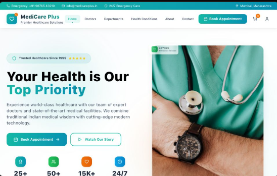

# Hospital Management System

<p align="center">
  
</p>


A comprehensive **web-based platform** to manage all aspects of hospital operations — from **doctor details** to **department and ward management**, along with **specialized care** for different medical conditions. This system ensures smooth administration, better patient experience, and centralized record management.


## Features

### 1. **Doctor Management**

* Add, edit, and delete doctor profiles
* Store qualifications, specializations, experience, and contact details
* Assign doctors to specific departments and wards
* Manage doctor availability and schedules

### 2. **Department Management**

* Maintain multiple departments (Cardiology, Neurology, Orthopedics, etc.)
* Assign doctors and nurses to departments
* Track department-specific resources and services

### 3. **Ward Management**

* Create and manage different wards (General, ICU, Maternity, Pediatrics)
* Assign ward in-charge doctors and nurses
* Monitor bed availability and occupancy status

### 4. **Specialized Care Management**

* Keep track of specialized treatment units (Cancer Care, Cardiac Surgery, Dialysis)
* Assign expert doctors to each specialization
* Maintain specialized equipment inventory

### 5. **Other Functionalities**

* Search and filter doctors/departments/wards
* Role-based access control for Admin, Doctors, and Staff
* Centralized dashboard for hospital statistics
* Responsive design for mobile and desktop


## Tech Stack

**Frontend:**

* React.js 
* Tailwind CSS
* Typescript
* Axios for API requests


## Installation & Setup

1. **Clone the Repository**

   ```bash
   git clone https://github.com/username/MediCarePlus.git
   cd hospital-management
   ```

2. **Frontend Setup**

   ```bash
   cd frontend
   npm install
   npm run dev
   ```


## Roles & Permissions

| Role   | Permissions                                                     |
| ------ | --------------------------------------------------------------- |
| Admin  | Full access to doctors, departments, wards, and specializations |
| Doctor | Manage patient records, view schedules, update availability     |
| Staff  | Update ward status, assist in patient allocation                |


## Future Enhancements

* Patient appointment booking
* Real-time bed availability tracker
* Telemedicine integration
* Hospital billing system
* AI-based patient record analysis

